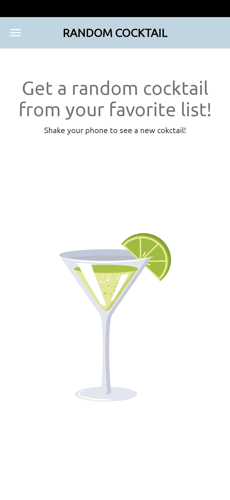

# My Cocktails

This is an App for the final project of the course Android Kotlin Developer by Udacity.  
My love for cocktails lead me to find [The Cocktail DB](https://www.thecocktaildb.com/api.php).  
From here i thought in creating an app where we can find some cocktails and learn how to make them. My job was to simplify the readability of the api.  
I am not very good in design so there is plenty of room for improvements in the app.

**For the app to work please provide Google map API KEY in the file 'local.properties'! like so MAPS_API_KEY=your_api_here**

## UI

The app consists in the following screens:

- Login screen where we can use our own email or google's account to login.
- List of cocktails from the API.
    - Here we can click on the star to make it our favourite and see if the cocktail is already on our database (this is helpful for offline mode because if it
      exists in database we can see it offline)
- Screen for the details of the cocktail.
    - On this screen we can scroll from the bottom of the image to the top and see all the instruction without need of scroll (*MotionLayout* here)
- List of Favourite cocktails (this list is like the list of cocktails but only has the favourites ones)
- Screen for a Random Cocktail
    - Just shake your device and it will show you a random cocktail
- A map to see some places i choose where we can drink a good Cocktail and relax. Here we have the possibility to get location from device so we can see if we
  are far or close to the place.

## Images

Login Screen               |  Side Menu                |  List of Cocktails        |  Cocktail Details
:-------------------------:|:-------------------------:|:-------------------------:|:-------------------------:
 |  |  | 

Random Cocktail            |  Map Screen
:-------------------------:|:-------------------------:
 | 

## Attributions

For this project i use some icons that i search in [Freepick](https://www.freepik.com/home) and in [Flaticon](https://www.flaticon.com/).

- The cocktail glass for logo and icon: <a href="https://www.freepik.com/vectors/summer-cocktail">Summer cocktail vector created by freepik - www.freepik.com<
  /a>
- The icon in the list of cocktails saying if the cocktail is in the database or not: <a href='https://www.freepik.com/vectors/right-wrong'>Right wrong vector
  created by starline - www.freepik.com</a>
- Hopfully an image that we don't see often (The picture that appears if there is no image associated with a
  cocktail): <a href="https://www.flaticon.com/free-icons/picture" title="picture icons">Picture icons created by Payungkead - Flaticon</a>

## Implementations

For the project i used Koin dependency injection, retrofit for the API calls (with moshi), Room database for persist memory, Navigation component (jetpack),
GoogleMaps SDK, just to name a few.

I would like to leave this ones too:

- [Joda Time](https://github.com/JodaOrg/joda-time)
- [CircleImageView](https://github.com/hdodenhof/CircleImageView)
- [Material Dialogs](https://github.com/afollestad/material-dialogs)
- [Coil](https://github.com/coil-kt/coil)

You can see in the gradle file all the implementations. There are some that i intend to use latter on (like Firebase).

### Finally
If you have any doubts about the project please leave a comment or email me: hfs.ventura@gmail.com